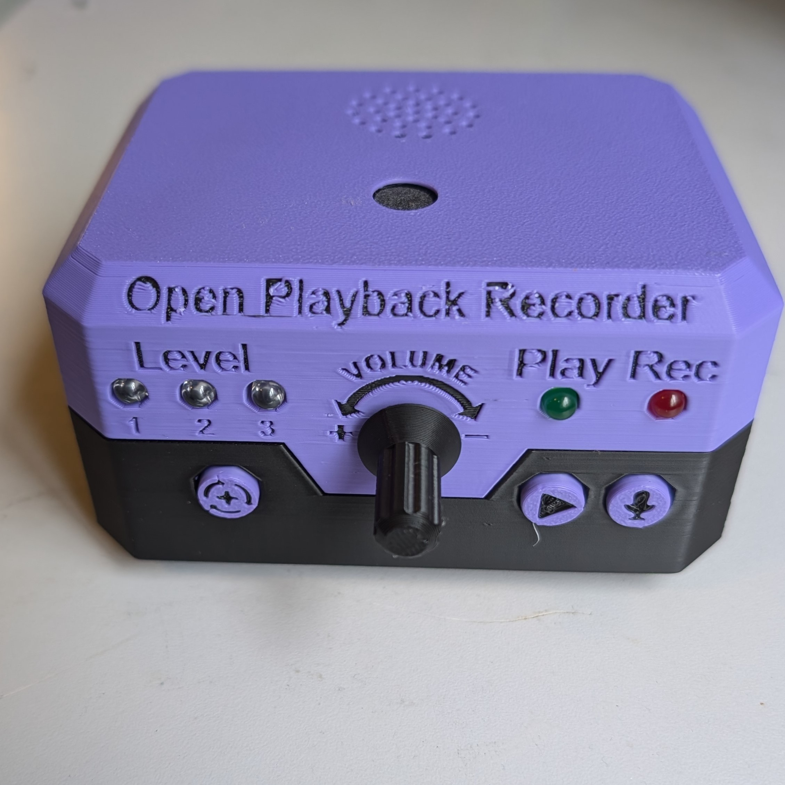

 
 # Open Playback Recorder

The Open Playback Recorder is an open-source device that can record three lists of voice messages that its user can playback via the trigger of an accessible button connected through a 3.5 mm mono jack. It aims to assist users with communication difficulties by giving them alternative methods to engage in conversation. This device has functionality similar to AbleNet’s Big Mack or Step by Step. The device is comprised of off-the-shelf electronics and 3D printed parts. The overall cost of materials is about $80 (plus $8 for component shipping).

## More info at
- [Makers Making Change Project Page](https://www.makersmakingchange.com/s/product/open-playback-recorder)

## How to Obtain the Device
### 1. Do-it-Yourself (DIY) or Do-it-Together (DIT)

This is an open-source assistive technology, so anyone is free to build it. All of the files and instructions required to build the device are contained within this repository. Refer to the Maker Guide below.

### 2. Request a build of this device

You may also submit a build request through the [MMC Library Page](https://makersmakingchange.com/project/open-playback-recorder/) to have a volunteer maker build the device. As the requestor, you are responsible for reimbursing the maker for the cost of materials and any shipping.

### 3. Build this device for someone else

If you have the skills and equipment to build this device, and would like to donate your time to create the device for someone who needs it, visit the [MMC Maker Wanted](https://makersmakingchange.com/maker-wanted/) section.

## Build Instructions

### 1. Read through the Maker Guide

The [Maker Guide](/Documentation/Open_Playback_Recorder_Maker_Guide_V1.0.pdf)  contains all the necessary information to build this device, including tool lists, assembly instructions, programming instructions (if applicable) and testing.

### 2. Order the Off-The-Shelf Components

The [Bill of Materials](/Documentation/Open_Playback_Recorder_BOM_V1.0.xlsx) lists all of the parts and components required to build the Open Playback Recorder. The components for this device needs to be ordered online.

### 3. Print the 3D Printable components

All of the files and individual print files can be in the [/Build_Files/3D_Printing_Files](/Build_Files/3D_Printing/) folder.

### 4. Assemble the Open Playback Recorder

Reference the [Maker Guide](/Documentation/Open_Playback_Recorder_Maker_Guide_V1.0.pdf) for the tools and steps required to build each portion.

## How to improve this Device
As open source assistive technology, you are welcomed and encouraged to improve upon the design. 

## Files
### Documentation
| Document             | Version | Link |
|----------------------|---------|------|
| Design Rationale     | 1.0     | [Open_Playback_Recorder_Design_Rationale](/Documentation/Open_Playback_Recorder_Design_Rationale_V1.0.pdf)     |
| Maker Guide          | 1.0     | [Open_Playback_Recorder_Maker_Checklist](/Documentation/Open_Playback_Recorder_Maker_Guide_V1.0.pdf)     |
| Bill of Materials    | 1.0     | [Open_Playback_Recorder_Bill_of_Materials](/Documentation/Open_Playback_Recorder_BOM_V1.0.xlsx)     |
| User Guide           | 1.0     | [Open_Playback_Recorder_User_Guide](/Documentation/Open_Playback_Recorder_User_Guide_V1.0.pdf)    |
| Changelog            | 1.0     | [Open_Playback_Recorder_Changelog](CHANGES.txt)     |

### Design Files
 - [CAD Files](/Design_Files/CAD)

### Build Files
 - [3D Printing Files](/Build_Files/3D_Printing)

### Software Files
 - [Software Files](/Build/Software_Files)

## Attribution
Designers:
 - Neil Squire Society / Makers Making Change

Contributors

## License
Copyright (c) 2024 Neil Squire / Makers Making Change.

This repository describes Open Hardware:
 - Everything needed or used to design, make, test, or prepare the Open Playback Recorder is licensed under the [CERN 2.0 Weakly Reciprocal license (CERN-OHL-W v2) or later](https://cern.ch/cern-ohl ) .
 - All software is under the [GNU General Public License v3.0 (GPL-3.0)](https://www.gnu.org/licenses/gpl.html).
 - Accompanying material such as instruction manuals, videos, and other copyrightable works that are useful but not necessary to design, make, test, or prepare the Open Playback Recorder are published under a [Creative Commons Attribution-ShareAlike 4.0 license (CC BY-SA 4.0)](https://creativecommons.org/licenses/by-sa/4.0/) .

You may redistribute and modify this documentation and make products using it under the terms of the [CERN-OHL-W v2](https://cern.ch/cern-ohl).
This documentation is distributed WITHOUT ANY EXPRESS OR IMPLIED WARRANTY, INCLUDING OF MERCHANTABILITY, SATISFACTORY QUALITY AND FITNESS FOR A PARTICULAR PURPOSE.
Please see the CERN-OHL-W v2 for applicable conditions.

Source Location: https://github.com/makersmakingchange/Open-Playback-Recorder

---

## About Makers Making Change

Makers Making Change is a program of [Neil Squire](https://www.neilsquire.ca/), a Canadian non-profit that uses technology, knowledge, and passion to empower people with disabilities.

Makers Making Change leverages the capacity of community based Makers, Disability Professionals and Volunteers to develop and deliver affordable Open Source Assistive Technologies.

 - Website: [www.MakersMakingChange.com](https://www.makersmakingchange.com/)
 - GitHub: [makersmakingchange](https://github.com/makersmakingchange)
 - Twitter: [@makermakechange](https://twitter.com/makermakechange)
 - Instagram: [@makersmakingchange](https://www.instagram.com/makersmakingchange)
 - Facebook: [makersmakechange](https://www.facebook.com/makersmakechange)
 - LinkedIn: [Neil Squire Society](https://www.linkedin.com/company/neil-squire-society/)
 - Thingiverse: [makersmakingchange](https://www.thingiverse.com/makersmakingchange/about)
 - Printables: [MakersMakingChange](https://www.printables.com/@MakersMakingChange)

### Contact Us
For technical questions, to get involved, or to share your experience we encourage you to [visit our website](https://www.makersmakingchange.com/) or [contact us](https://www.makersmakingchange.com/s/contact).